## _C2 Course - SOC Project_  

More Info: https://www.centreforcybersecurity.com/programmes

_Objective:
Create a script that runs different cyber attacks in a given network to check if monitoring alerts appear_

_Functions:_
_- Install relevant applications on the computer_
_- Execute network scans and attacks_
_- Save into a log all of the activities executed by code_

# Perseus.sh
A script that examines the network to find machines, and gives the user the option to use nmap or masscan, and then execute a variety of attacks on the target. Two versions - one for those that haven't made lolcat executable from PATH

## When script starts
Check if executed by Root user, otherwise issue reminder and quit:
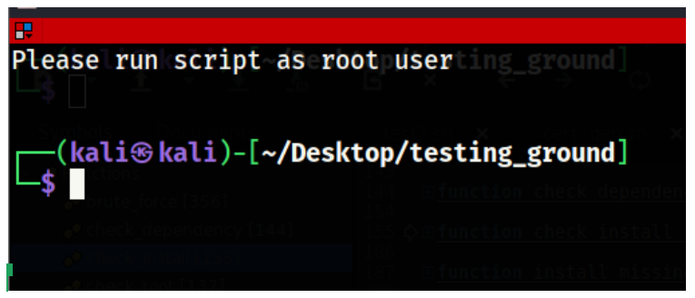

Check if perseus_logs  folder exists in /var/log. If it doesn’t create it.
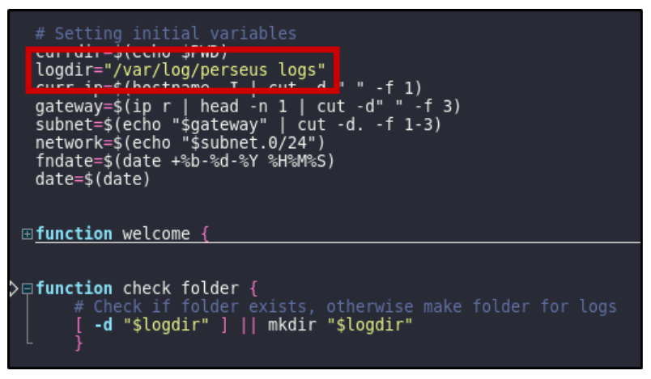

Then proceed to welcome screen

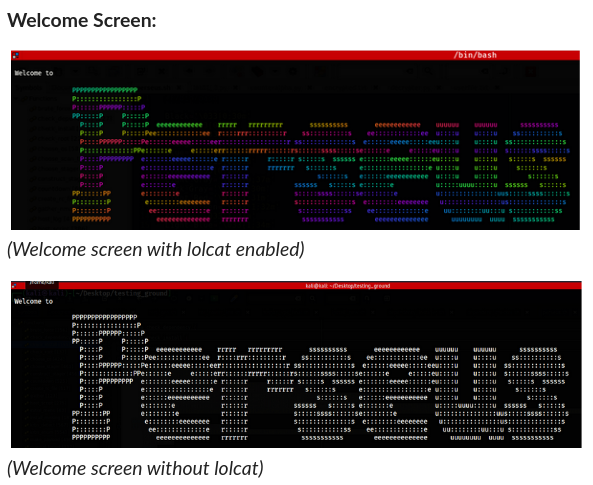

Check for missing programmes and ask for permission to install:

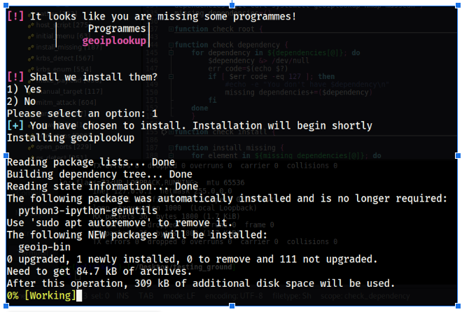

## Scan Phase

Into main script after installation of missing programmes

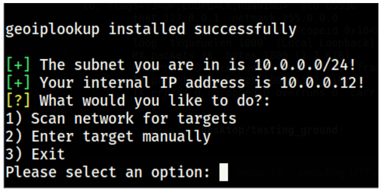

OR into main script without installation if necessary programmes present

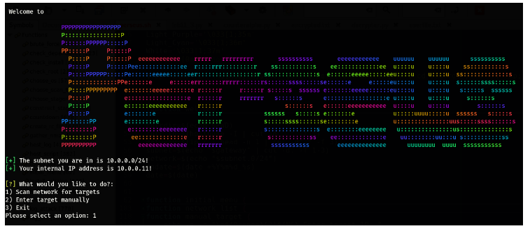

Scanning message

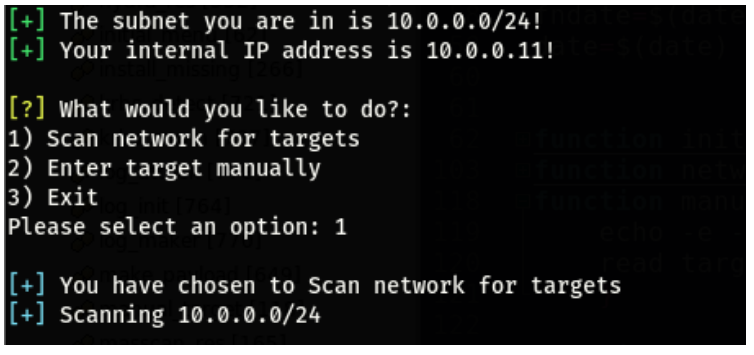

Enumerate Hosts on network and generate list to choose target OR Enter target manually.
Then choose desired scan method - nmap or masscan.

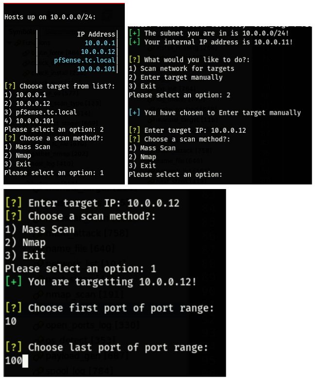

## Masscan
Choose first and last ports to set range

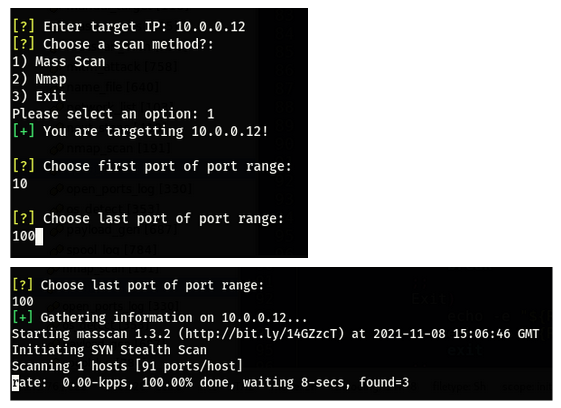

Discovered ports will be listed and programme will ask for follow-up action

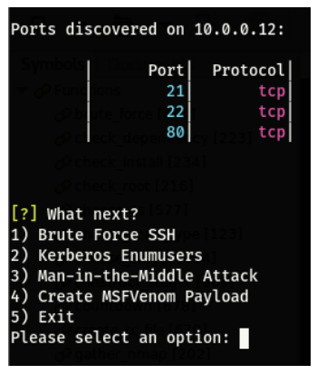

## Nmap
Script will automatically ``` nmap -A``` the target

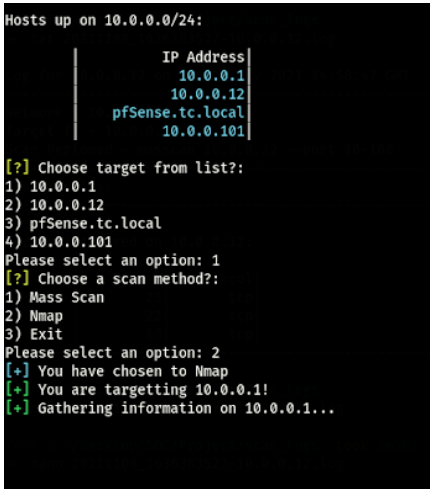

Discovered information (ports, protocols, services, and versions) will be displayed to the user

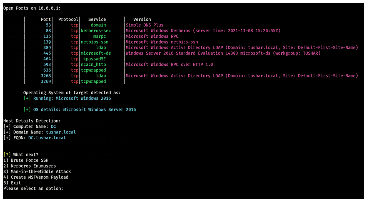

## Brute Force SSH

### Through Masscan

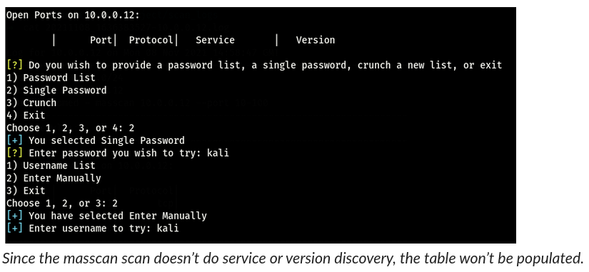

List successfull credentials and exit

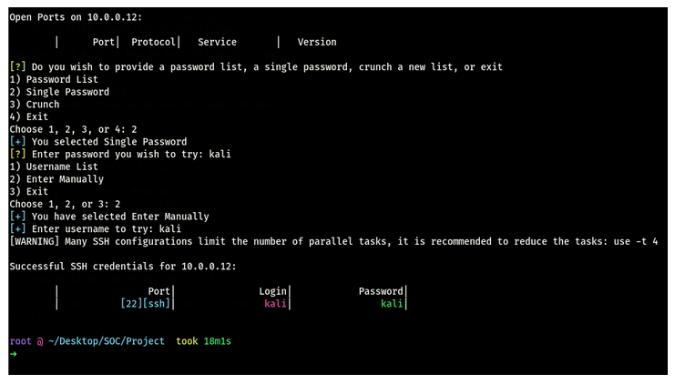

### Through Nmap

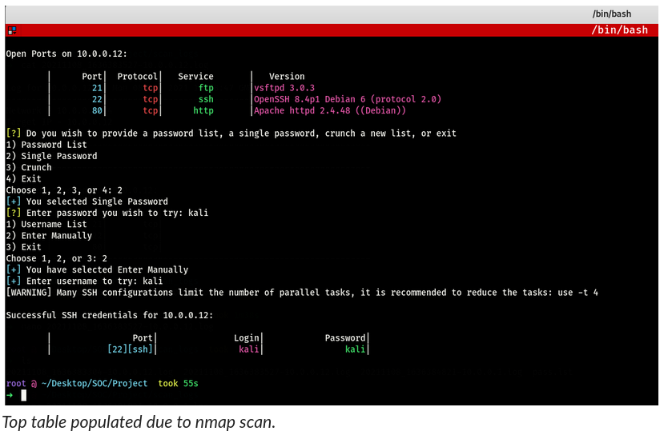

## Kerberos Enum (msfconsole)

### Through Nmap


Enter information to create msfconsole resource file

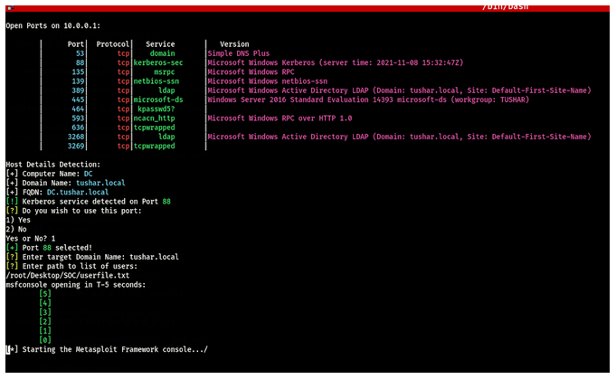

Example msfconsole output

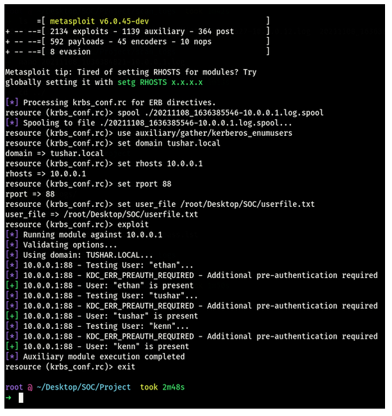

### Kerberos service not detected, manual port entry (for example if masscan is used instead of nmap):

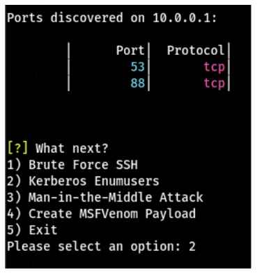

Kerberos not detected since masscan did not do service detection. Enter other information as per usual. The rest of the results are the same as above . 

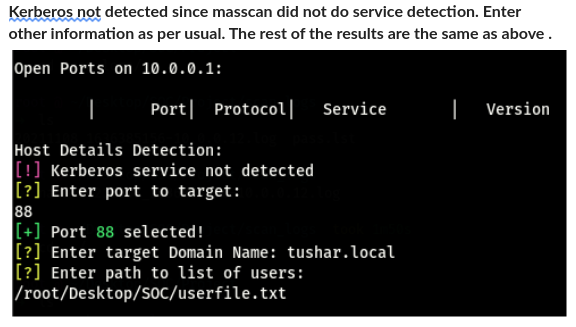

## Man in the Middle

The MitM attack in this is meant to be an Arp Spoof, but that only works on my computer due to the need for custom .pyarp spoofer

The script gets the ip of the target and the ip of the gateway automatically.

## MSF Venom Payload Creation

Select Victim OS (nmap scan recommended for more info):

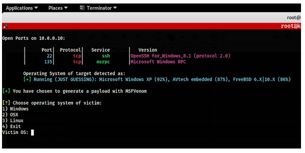

Select Stager, name file, select target port:

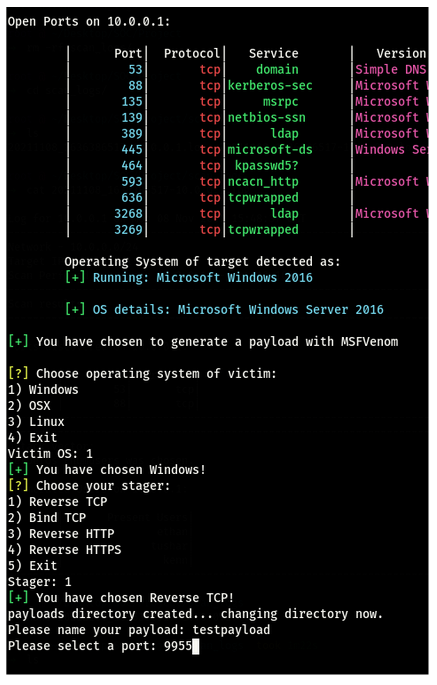

RC file is built and MSF Console is launched:

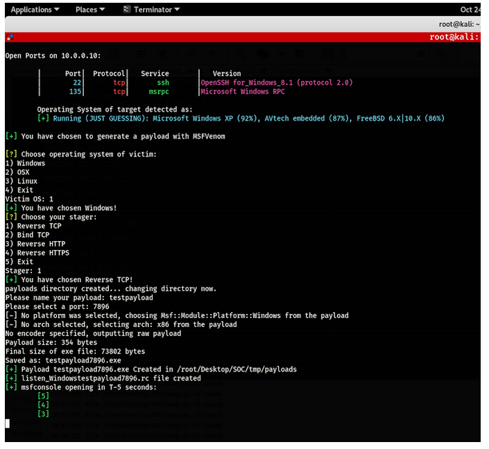

MSF Console using RC file to set options and run exploit/multi/handler

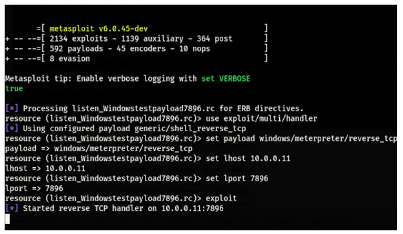

exploit/multi/handler session begun:

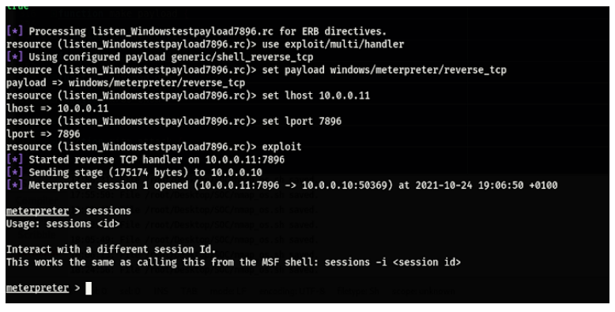

## Generated Log Samples

Nmap into MSF console Kerberos Enumusers

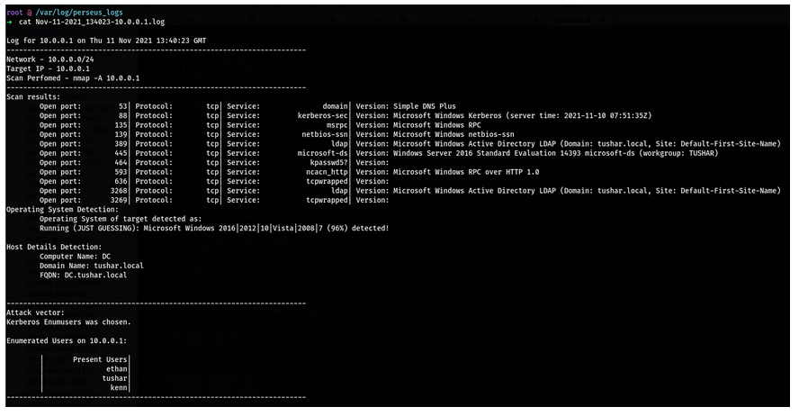

Masscan into Brute Force SSH (Hydra)

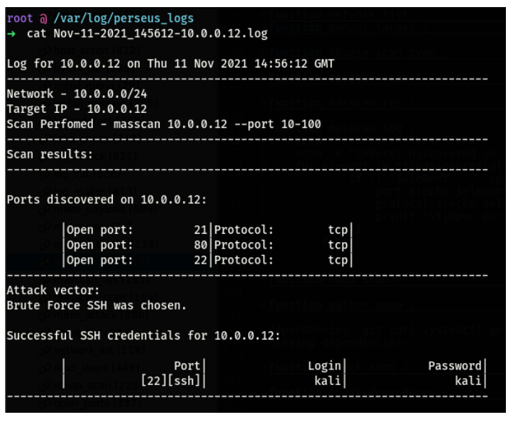

Masscan into MitM:

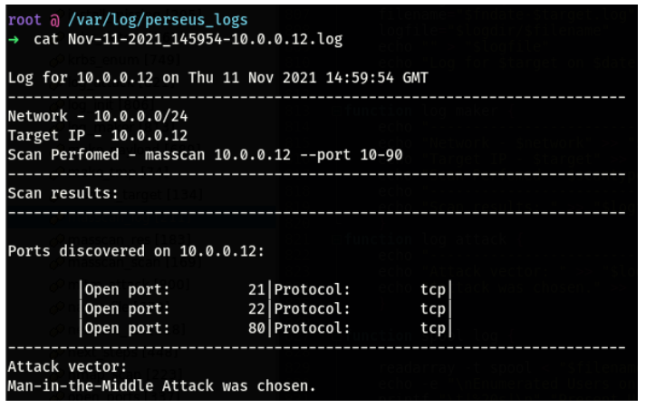

Masscan into MSFVenom and then console:

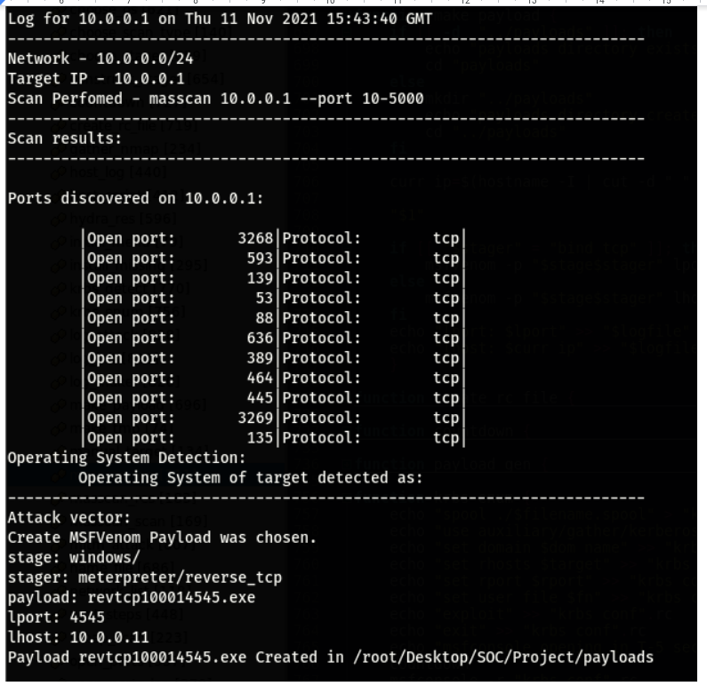

Nmap into MSFVenom then console

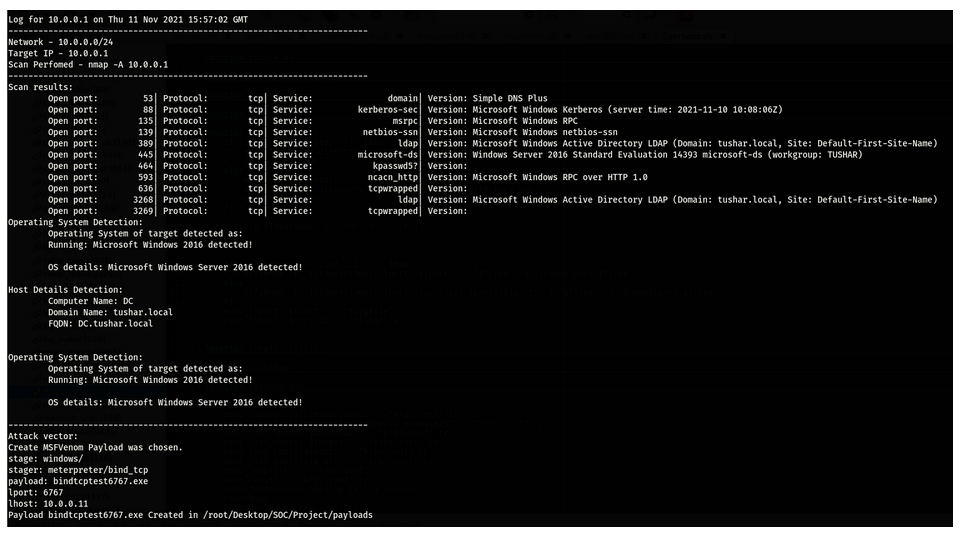
